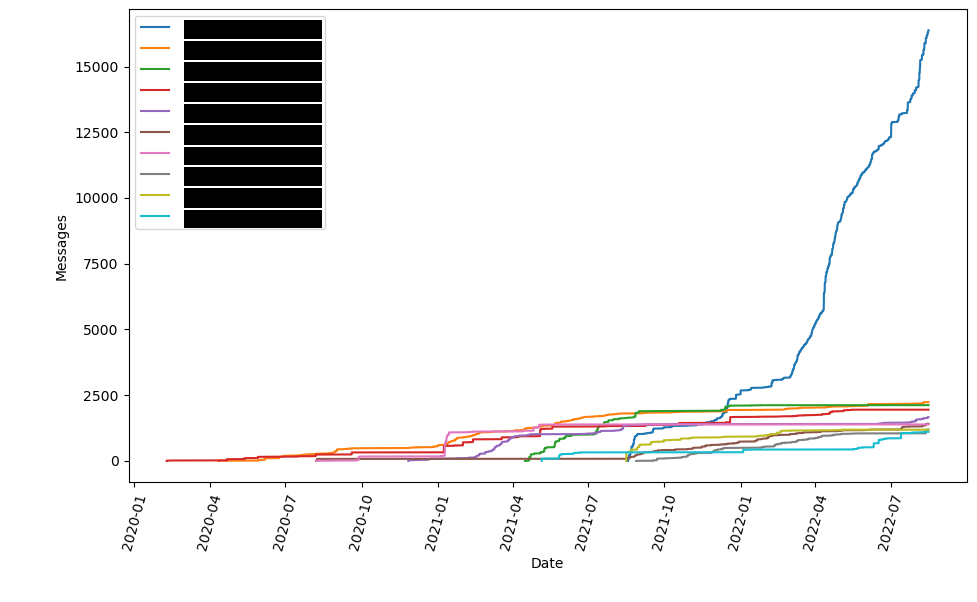

# Graphcord
Graphcord allows you to take your discord data and graph your messages over time

## Download
```sh
git clone https://github.com/Atli-A/Graphcord.git

cd Graphcord
```

## Usage
Make sure you have python3 installed as well as matplotlib

To run graphcord download it and run 
```sh
./graphcord.py path/to/your/data/package/zip
```
To specify the top *n* users use the -n flag. For example, this shows the first 15 
```sh
./graphcord.py path/to/your/data/package/zip -n 15
```


## Example
